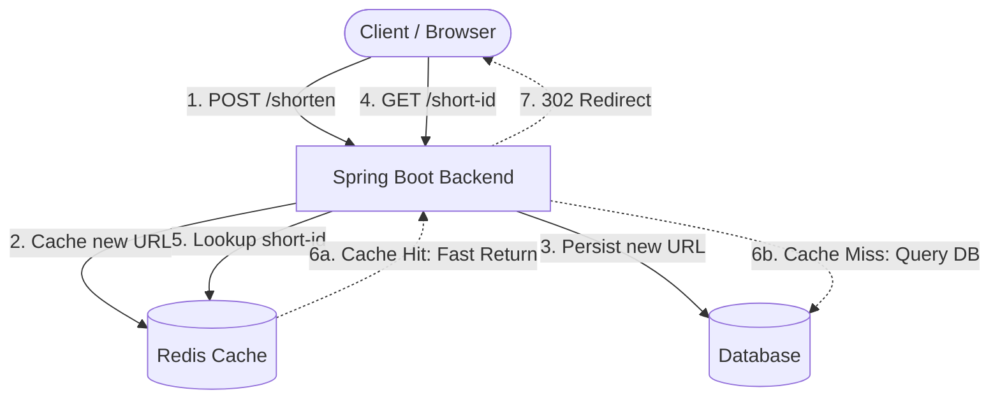

# URL Shortener App 🚀

A full-stack application for shortening long URLs. Built with **Java Spring Boot**, **Vite**, **React**, and **Material UI**.

## 📸 Screenshot

<!--  -->


## 🏗️ Architecture



## ✨ Features

- **Clean & Modern Interface**: Built with Material UI components for a premium look.
- **Instant Shortening**: Fast API integration to generate short URLs on the fly.
- **Smart Proxying**: Bypasses browser CORS and `localhost` HTTP restrictions by securely proxying requests directly through the Vite dev server.
- **Seamless Redirection**: Clicking the generated short URL securely forwards the GET request to the backend and handles the `302` redirect.

## 🛠️ Tech Stack

- **Backend Framework**: Java Spring Boot
- **Frontend Framework**: React + TypeScript
- **Build Tool**: Vite
- **Styling & UI**: SCSS + Material UI (`@mui/material`)

## ⚡ Redis Caching (Core Architecture)

The backend heavily utilizes **Redis** for caching to ensure high performance and low latency. Since the core functionality of a URL shortener involves frequent read operations (redirecting from a short URL to the original URL), Redis serves as an in-memory data store to quickly retrieve the long URLs without hitting the primary database on every request. This significantly reduces the response time and allows the application to scale efficiently under high traffic.

## 🔀 Redirection: 302 vs 301

We intentionally use **302 Found (Temporary Redirect)** instead of **301 Moved Permanently** for forwarding users to the original URL.
- **Why not 301?** A 301 redirect is aggressively cached by browsers. If a browser caches the redirect, subsequent clicks on the short URL would bypass our server entirely and go directly to the destination.
- **Why 302?** By using a 302 redirect, we ensure that every click passes through our server first. This allows us to track analytics (like click counts, referrer data, and timestamps) accurately for every single visit before forwarding the user.

## 🚀 Getting Started

### Prerequisites
Make sure you have [Node.js](https://nodejs.org/) installed on your machine.
You will also need your Java Spring Boot backend running on port `8080`.

### Installation

1. Install dependencies:
   ```bash
   npm install
   ```
2. Start the development server:
   ```bash
   npm run dev
   ```
3. Open your browser and navigate to the URL provided by Vite (usually `http://localhost:5173`).

### Backend Integration
The app relies on your Java backend running at `localhost:8080`.
- **POST `/shorten`**: Receives the original URL and generates the short URL ID.
- **GET `/{id}`**: Redirects the user to the original URL.
*(All requests are automatically proxied via Vite's `vite.config.ts` to avoid CORS issues).*

## 📝 License
This project is open-source and available under the MIT License.
